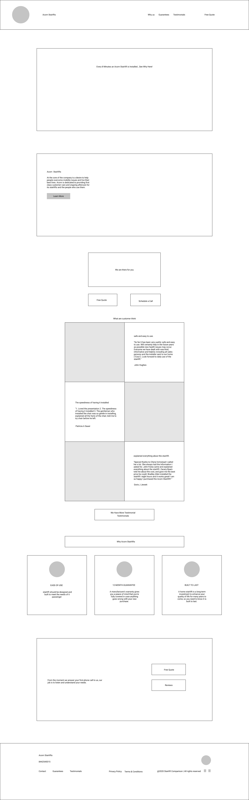
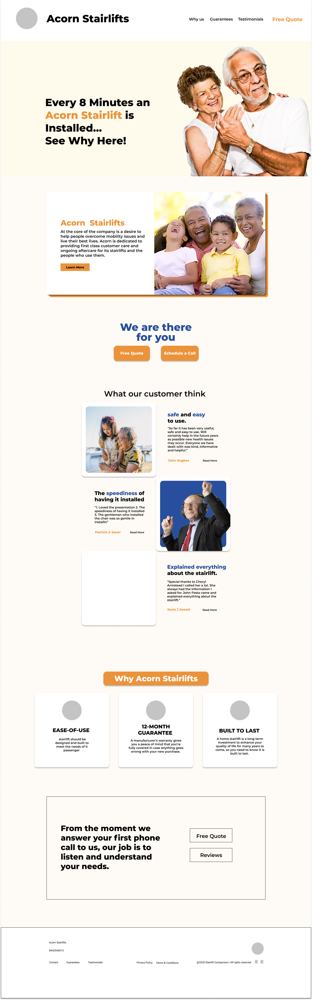

# Acorn Stairlifts Microsite

Scope - Create a Why MicroSite that incorporates Info about Acorn Stairlifts and http://best-stairlift-reviews.com/. Create a sense of urgency to purchase or look up Acorn Stairlifts

## Target Audience

- Possible family members of potential Acorn Stairlift customers
- Spouse
- Busy your professional children

## Needs

- Highly Accessible Website
- Digestible Content
- Internal Target Narrative towards goal

## Aesthetic and Style

- minimal
- Large Readable Font
- Good Color Contrast

## Special Notes

- Get Free Quote Button
- Easy Installation and No reconstruction needed
- Year round customer service available 24/7
- FastTrack System

### Photo Copy of Website
.png)
.png)
.png)
.png)
.png)
.png)
.png)

## FIGMA links and wireframes
Links: 
[Link]https://www.figma.com/file/3WfJi3XPQCxZBH55HeNokt/FInalizedAcornChairlift
[Link]https://www.figma.com/file/cDnJmynHG17WkRPoyf9Jp1/Acorn-Stairlifts-Why-Us-Microsite?node-id=0%3A1

## Figma Final design and assets

